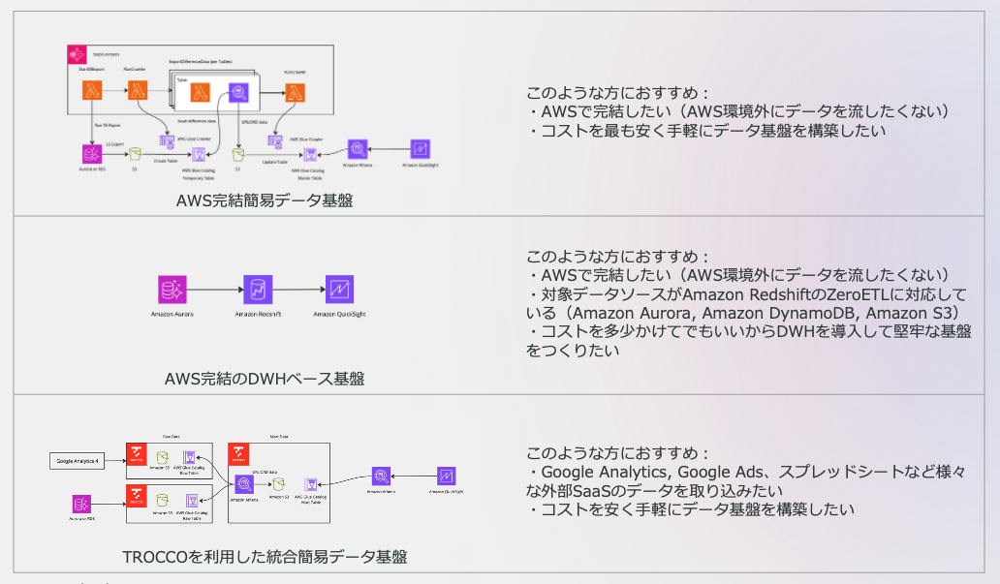

# Data Pipeline Samples for Startups 

このレポジトリはスタートアップ向けのデータ分析基盤の構築サンプル集です。主に、RDSなどのデータベースからデータを同期し、BIツールでデータの可視化を行うサンプルを提供します。

This repo is the examples of Data Pipeline Platform on AWS for Startups. Mainly, the example that syncing to DWH from RDS and visualize with BI. 

## 構成パターン

* [AWS完結の簡易データ基盤](./aurora-athena-sample)
* [AWS完結のDWHベース基盤](./zero-etl-sample/)
* [TROCCO](https://trocco.io/)を用いた[統合簡易データ基盤](./trocco-athena-sample/)
* [WIP] DuckDBをベースとしたサンプル

その他マイルストーンはIssuesを参考にしてください。

## The cases
* [The low cost pipeline with athena](./aurora-athena-sample)
* [The data warehouse case with Redshift and Zero ETL](./zero-etl-sample/)
* [The integrastion](./trocco-athena-sample/) from SaaS case with [TROCCO](https://trocco.io/)
* [WIP] The sample with DuckDB

Please refer other milestones to the Issues.

## Licence
This library is licensed under the MIT-0 License. See the [LICENSE](./LICENSE) file.

