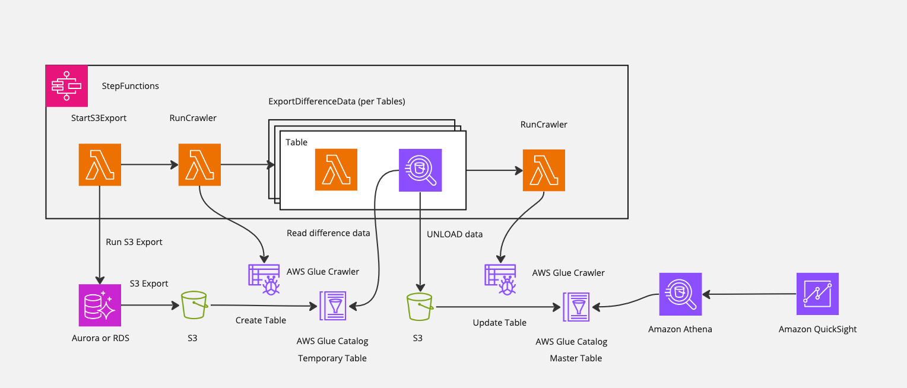
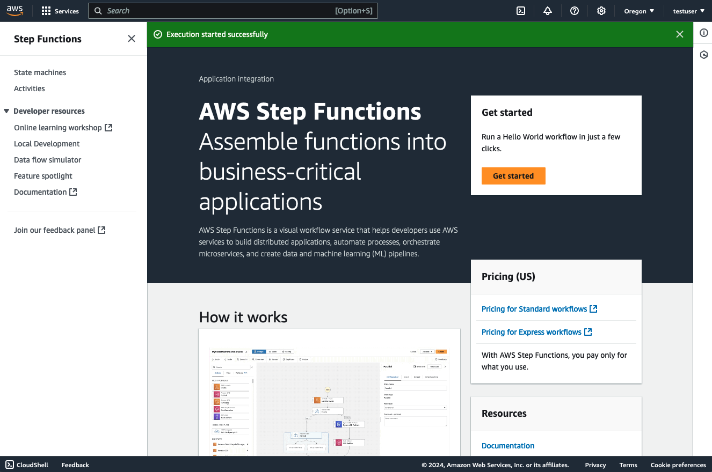
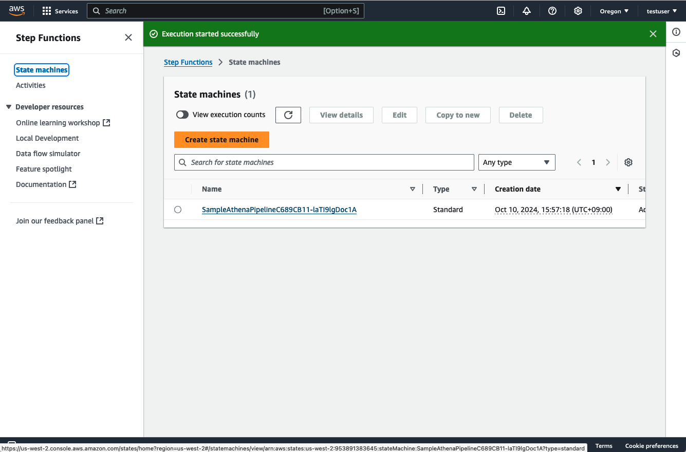
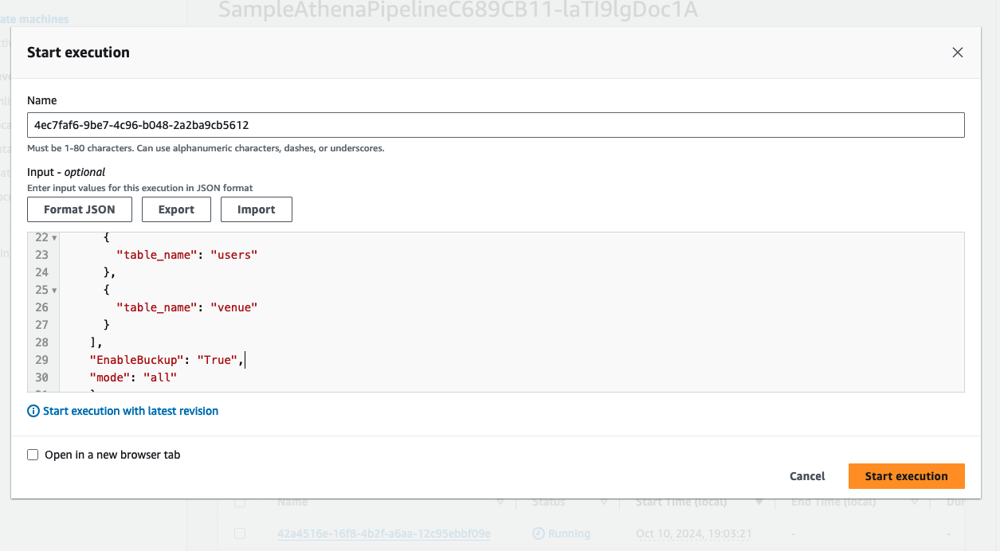
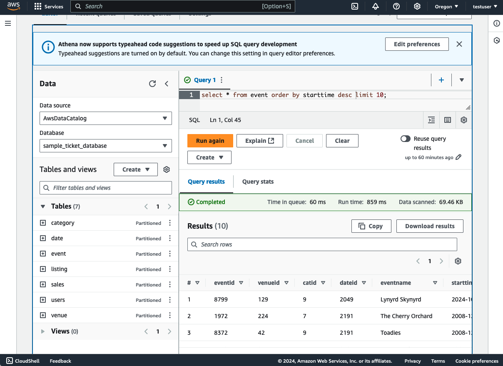
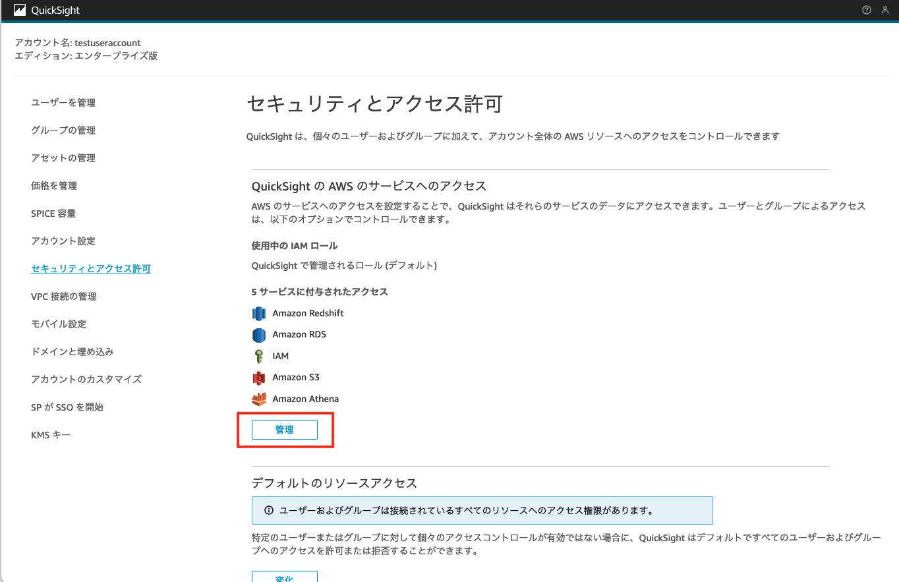
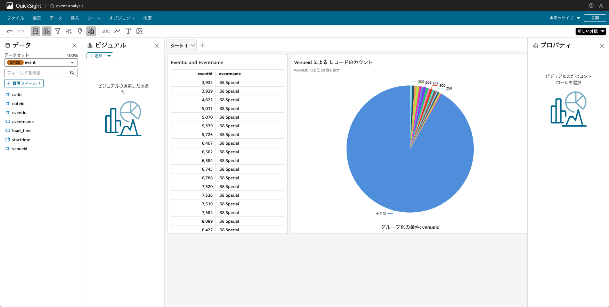

# Athenaを利用したAuroraのデータ分析パイプラインの構築

このサンプルは、RDSのデータをAthenaでクエリするためのパイプラインを構築します。RDSからS3 Exportを利用して差分抽出を行い、Athenaでクエリを行うことができるようになります。Athenaで構築した基盤をベースにQuickSightで分析します。

## 構成図


1. S3 Exportを利用してAuroraのデータをS3にExportします。
   * S3 Exportの仕様上、Export対象は全データとなります
2. Amazon Athenaでクエリを行えるようにAWS GlueのCrawlerを利用して、Temporary Tableを作成します。
   * このTemporary Tableはデータのロードごとに削除されます
3. TableごとにTableのレコードのTimestamp情報を読み取り、差分更新分を検索しS3にExportします
4. AWS Glue Crawlerを利用して、差分データをMasterTableに更新します
5. AthenaおよびQuickSightでMaster Tableにクエリをかけます


## 本サンプルでの月額コスト例


1日に10人が10回ほどフルスキャンでクエリし、QuickSight上でデータを分析するケースを想定します。  
* 分析対象のデータ量は100GBあり、Parquetファイルに圧縮後は33GBとする
* 一日に一回更新を行う

おおよその月額費用：**563.244 USD**

|サービス名|費用|計算|
|---|---|---|
|S3 Export|36 USD| 100GB × 0.012(USD/GB)× 30 (days)|
|Glue Crawler|2.244 USD|0.44(USD/hour) / 6 (USD/10min) ×　30 (days)|
|Glue Catalog|Free|Glue Catalog: 10(人) × 10(クエリ/day) × 30(days) < 100万回未満のため無料|
|Athena|495 USD|0.033(TB) × 5(USD) × 10(人) × 10(クエリ/day) × 30(days)|
|QuickSight|30USD|3(USD) × 10(人)|


## 構築手順

1. (サンプルデータを利用する場合) S3に任意のバケットを作成し、`sample/sample.tar.gz`　を解答した .txt　ファイルをS3にアップロードします。
※ snapshot用のバケットは自動で作成されるので、作成しないでください。

2. `config/config.ts`のStackのProps上のパラメーターを更新する。

|Paramter|内容|必須|
|---|---|---|
|pipelineName|全体パイプラインの総称|必須|
|isExistDB|既存のDBの利用有無|必須|
|dbClusterName|RDSのクラスター名|必須|
|dbName|RDSのデータベース名|必須|
|schemaName|対象のRDSのスキーマ名|必須|
|tables|RDSの対象のテーブル名と差分抽出用のタイムスタンプが含まれる列名(※)|必須|
|sampleDataBucketName|RDS取り込む用のサンプルデータ|必須|
|snapshotS3BucketName|S3Exportおよび実データの出力バケット|必須|
|s3ExportPrefix|S3Exportのデータ出力先パス|必須|
|enableBackupExportedData|S3 Exportにて出力されたRDSのデータの保存の有効化フラグ|必須|


※ デフォルトの差分抽出のロジックは、レコードごとに定義されているタイムスタンプに対して、実行時間から指定期間に当てはまるタイムスタンプを抽出して出力します。（もし列名を指定しない場合はデータ更新がスキップされます）

パラメーター例は `config/config.ts`を参照してください。


3. cdkのコマンドを実行する

```
cdk deploy --all
```

4. (新規でデータベースを作成する場合)　サンプルデータを取り込みます。
   1. EC2からRDSへのアクセスを行います。Management Console上でEC2のサービスページを開き、`SampleDataSourceStack`から始まるインスタンス名を選択し、”Connect”をクリックします
   2. 本サンプルではSessionManagerからアクセスできるようになっています。SessionManagerタブを選択して、Connectします
   3. データベースのパスワードはSecretManagerに保存されています。Management Console上でSecretManagerのサービスページにアクセスし、デプロイ時の出力されたパラメーターのうち `SampleDataSourceStack.RdsCredentialPath` で出力されているSecret名をクリックします
   4. Secret Valueのにて、 `Retrieve secret value`　をクリックすると、パスワードが表示されます。こちらを控えます。
   5. デプロイ時に出力されたパラメーターを利用して、以下のコマンドを入力します 

    ```
    mysql -h <ZeroETLRDSStack.DBClusterHostname> -u admin -p
    ```
    パスワード入力が求められるので、パスワードを入力します。

   6. `sample/setupdata.sql` の `--- EDIT S3 BUCKET ---` 以降で、手順1にて作成したS3バケットのバケット名を変更します。デフォルトは `sample-ticket-data`となっています。
   7. `sample/setupdata.sql` のSQL文を入力すると、データベース、テーブル、およびデータの挿入が実行されます


5. RDSのデータを全ロードする。  
デフォルトは差分更新モードになっていますが、RDSのデータを全ロードするオプションがあります。初回はこちらを利用して、データの全ロードを行います。

   1. AWS Management Console上で、StepFunctionサービスを開く
   

   2. `SampleAthenaPipeline`から始まるステートマシーンを選択する
    

   3. `sample/sfninput.json` を参考に、JSONをInputとして入力し、Start Executionを押下する

   ```
   {
    "Tables": [
      {
        "table_name": "event",
        "condition": "starttime"
      },
      ...
    ],
    "EnableBuckup": "True",
    "mode": "all"
    }
   ```
   
   4. Athenaでクエリできれば完了です。
   

補足：手動で差分更新を行いたい場合  
手順5の全ロードするケースで入力したパラメーターのうち、modeを `diff`に変更してStepFunctionのステートマシーンを実行すると手動で差分更新ができます。 

```
   {
    "Tables": [
      {
        "table_name": "event",
        "condition": "starttime"
      },
      ...
    ],
    "EnableBuckup": "True",
    "mode": "diff"
    }
   ```


### Amazon QuickSightの設定

Amazon QuickSightのアカウント作成をされていない方はこちらをご参照ください。

https://docs.aws.amazon.com/ja_jp/quicksight/latest/user/signing-up.html

1. Amazon QuickSightに管理者としてログインする
2. 右上の「QuickSightを管理」＞「セキュリティとアクセスの許可」> 「QuickSight の AWS のサービスへのアクセス」から、「管理」をクリックする

3. S3を選択肢し、対象のS3Bucketのアクセス権限を付与する

4. トップに戻り、データソースの作成をデータソースにAthenaを設定する

5. 対象のワークグループ、作成されたGlueデータベース（PIPELINE名と同一です）、対象のテーブルを選択します


6. データセットが作成され、データの中身が作成できたり、分析上でダッシュボードを作成できるようになります。



## テーブルの抽出条件を変えたい場合
データの抽出は `lambda/extract-diff-data/index.py` にて変更可能です。デフォルトでは実行時間から1日間に遡って対象のデータをクエリします。

```
SELECT * FROM "{SCHEMA_NAME}_{table_name}" where "{condition}" > cast('{conditon_date}' as timestamp)
```
## データの加工をしたい場合
`lambda/extract-diff-data/index.py`上のUNLOAD箇所を増やすことでデータの加工プロセスを増やすことができます。その際、masterテーブル用のCrawlerのDataSourceも正しいか確認してください。

## 環境の削除

1. AthenaのQuery出力用のバケット内の出力データを削除する。
Management Consoleから、S3のサービスページを開き、 `AthenaQueryResultBucket` から始まるバケットを選択して `Empty`をクリックします。

2. Glueのテーブルを削除します  
Management Consoleから、Glueのサービスページを開き、Tables セクションを開きます。削除対象のテーブルを選択し、Deleteする。

3. 以下のコマンドで環境を削除する

```
cdk destroy --all
```


## Licence 
This library is licensed under the Apache 2.0 License. See the [LICENSE](./LICENSE) file.


