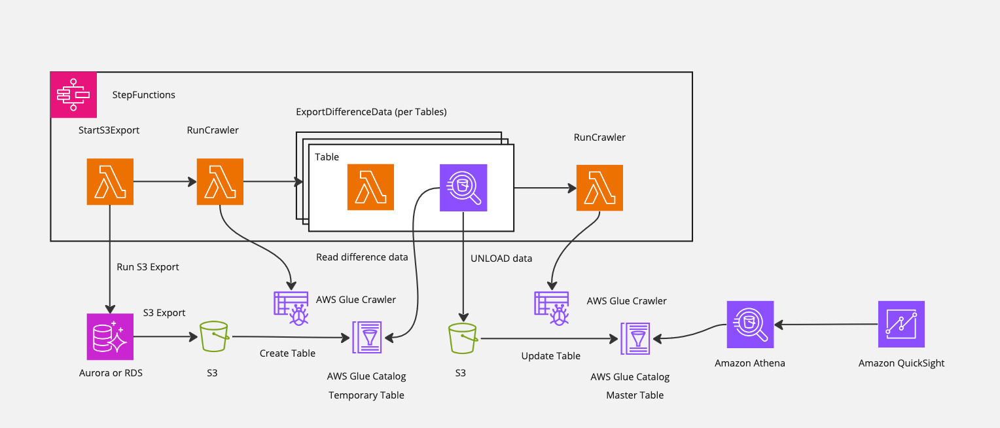

# Athenaを利用したパイプラインの構築
※ English follows Japanese.

このサンプルは、Amazon RDSのデータをAthenaでクエリするためのパイプラインを構築します。Amazon RDSからS3 Exportを利用して差分抽出を行い、Amazon Athenaでクエリを行うことができるようになります。Amazon Athenaで構築した基盤をベースにAmazon QuickSightで分析します。

## Architecture

1. S3 Export を利用して Aurora のデータを S3 にExportします。
   * S3 Exportの仕様上、Export対象は全データとなります
2. Amazon Athenaでクエリを行えるようにAWS GlueのCrawlerを利用して、TemporaryTable を作成します。
   * このTemporary Tableはデータのロードごとに削除されます
3. TableごとにTableのレコードのtimestamp情報を読み取り、差分更新分を検索し S3 にExportします
4. AWS Glue Crawlerを利用して、差分データを MasterTable に更新します
5. Athena および QuickSight で MasterTable にクエリをかけます

1日に10人が10回ほどフルスキャンでクエリし、QuickSight上でデータを分析するケースを想定します。  
* 分析対象のデータ量は100GBあり、Parquetファイルに圧縮後は33GBとする
* 一日に一回更新を行う

おおよその月額費用：**563.244 USD**

|サービス名|費用|計算|
|---|---|---|
|S3 Export|36 USD| 100GB × 0.012(USD/GB)× 30 (days)|
|Glue Crawler|2.244 USD|0.44(USD/hour) / 6 (USD/10min) ×　30 (days)|
|Glue Catalog|Free|Glue Catalog: 10(人) × 10(クエリ/day) × 30(days) < 100万回未満のため無料|
|Athena|495 USD|0.033(TB) × 5(USD) × 10(人) × 10(クエリ/day) × 30(days)|
|QuickSight|30USD|3(USD) × 10(人)|

## Getting started
[こちら](./doc/ja.md)  をご参照ください。

   
   

# The pipeline from Amazon RDS through Amazon Athena

This sample describes how to build a pipeline for querying data from RDS on Athena. You can export data from RDS to S3, query the data on Athena, and visualize it on Amazon QuickSight.

## Architecture

1. Export the data from Amazon Aurora to S3 using S3 Export.
   * Determined by S3 Export specificationm, the all data is exported. 
2. Create a temporary table through the AWS Glue crawler for querying on Amazon Athena.
3. Read the timestamp from the table records and export the difference data to S3.
4. Update the master table using the AWS Glue crawler.
5. Query the master table on Amazon Athena or Amazon QuickSight.

## Pricing example

The 10 persons query with a full scan 10 times per day, and analyze the data on Amazon QuickSight.

* The amount of data is 100GB, and in the zipped case, it is 33GB.
* Update data per day.

Appoximatery monthly cost: **563.244 USD**

|Service Name|Cost|Caluculate|
|---|---|---|
|S3 Export|36 USD| 100GB × 0.012(USD/GB)× 30 (days)|
|Glue Crawler|2.244 USD|0.44(USD/hour) / 6 (USD/10min) ×　30 (days)|
|Glue Catalog|Free|Glue Catalog: 10(人) × 10(Query/day) × 30(days) < Free Tier due to less than 1M access|
|Athena|495 USD|0.033(TB) × 5(USD) × 10(人) × 10(Query/day) × 30(days)|
|QuickSight|30USD|3(USD) × 10(人)|

## Getting started

Please refer [here](./doc/en.md)

## Licence 
This library is licensed under the Apache 2.0 License. See the [LICENSE](./LICENSE) file.

