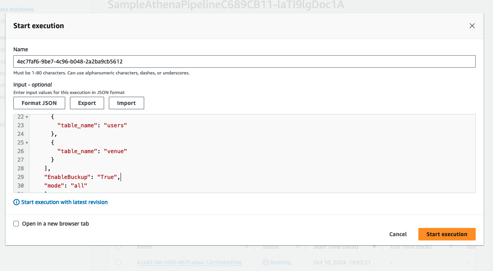
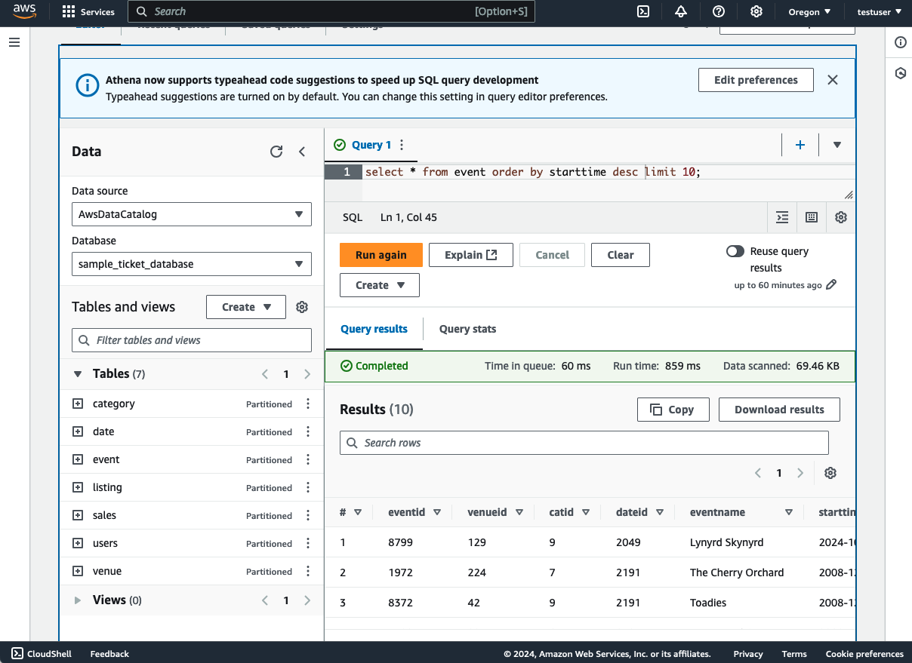

# Getting Started 

1. (If you use sample data) Create a bucket on S3, and upload the txt file from the unzipped `startup-data-pipeline-samples/sampledata/sample.tar.gz` file.  
※ DO NOT create the snapshot bucket because it is created automatically

2. Update the parameters in the `config/config.ts` file.

|Paramter|Details|Is Required|
|---|---|---|
|pipelineName|The name of pipeline|Yes|
|isExistDB|Use the DB created or not|Yes|
|dbClusterName|The name of database cluster|Yes|
|dbName|The name of database|Yes|
|schemaName|The name of schema|Yes|
|tables|The name of tables, and the columns containing timestamp for extracting difference from before.(※)|Yes|
|sampleDataBucketName|The bucket where the sample data for RDS is uploaded. |Yes|
|snapshotS3BucketName|The bucket where the snapshot data is saved. |Yes|
|s3ExportPrefix|The path where the data is exported. |Yes|
|enableBackupExportedData|The flag for saving RDS data created by S3 export. |Yes|
|loadSchedule|The interval of loading data from RDS. |Yes|


※ The default process of extracting differences from the previous data is to export data from the execution time to the defined range time.

Please also refer the example of the paramters to  `config/config.ts` file.

3. Run cdk command.
```
cdk deploy --all
```

4. (If you create the Aurora cluster with this sample.) Upload the sample data. 
   1. Access RDS from EC2. Open EC2 Service page on Management Console, select instance name starting with `SampleDataSourceStack`, and click "Connect".
   2.  In this sample, you can access by SessionManager. Select SessionManager tab and click "Connect". You will be able to access EC2 console.
   3.  The password of database is save in Secret Manager. Access the page of Secret Manager Service and click the secret desplayed as the name exported from the Outputs as `SampleDataSourceStack.RdsCredentialPath`.
   4.  Click `Retrieve secret value`, the password will be desplayed. Take this password.
   5.  In EC2 console, execute the following command.
   ```
   mysql -h <ZeroETLRDSStack.DBClusterHostname> -u admin -p
   ```
   6. Mofify the bucket name that is defined under of  `--- EDIT S3 BUCKET ---` on `sample/setupdata.sql`. The defalut value is `sample-ticket-data`.
   7. Execute the SQL in the `sample/setupdata.sql` file. The database, table, and data insertion will be started.


5. Upload the all of data from Amazon RDS.
This sample has an option to upload all the data from RDS. When you deploy, you can use this to upload the data initially.

   1. Open the AWS Step Functions Service page in the AWS Management Console.
   

   2. Select state machine stating with `SampleAthenaPipeline`
   

   3. Enter the config JSON (the following example)as INPUT referring to `sample/sfninput.json` , Click "Start Execution".
   ```
   {
    "Tables": [
      {
        "table_name": "event",
        "condition": "starttime"
      },
      ...
    ],
    "EnableBuckup": "True",
    "mode": "all"
    }
   ```
   
    4. Review querting on Athena.
    

TIPS: The case that you want to update the data differency.
You can update the data difference by changing the 'mode' parameter to `diff` and executing the state machine.

```
{
    "Tables": [
        {
        "table_name": "event",
        "condition": "starttime"
        },
        ...
    ],
    "EnableBuckup": "True",
    "mode": "diff"
}
```

## Setup visualisations on Amazon QuickSight

WIP

## The case of changing the condition of extracting data
WIP

## The case of adding the data process
WIP

## Destroy environment

1. Delete the bucket where the outputs of quering on athena was saved
Open the Amazon S3 Service page from Management console, select the bucket starting with `AthenaQueryResultBucket` , and click `Empty`

2. Delete the Glue tables
Open the AWS Glue Page and tables section. Delete the tables created by this pipeline.

3. Run the following command.


```
cdk destroy --all
```