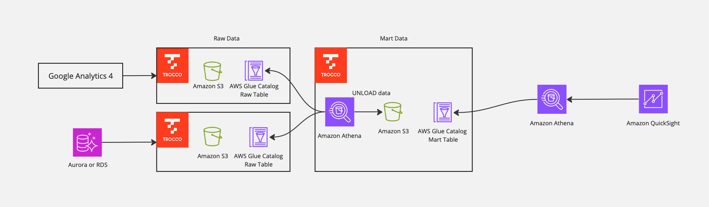

# The Data Pipeline with TROCCO and Athena
このサンプルではPrimeNumber社の[TROCCO](https://trocco.io/)とAthenaを利用した、カジュアルな分析基盤を構築します。

※本サンプルは、TROCCOから接続可能なテスト用のAuroraのデータベースおよびGUI上のセットアップ手順が記載されたDocumentのみの提供となります。全アーキテクチャを網羅するCDKおよびGoogle Analyticsのテストデータは含まれていないため、ご自身でご用意ください。

## 構成図

1. TROCCOを利用して、Google AnalyticsおよびAmazon Auroraからデータを取り込みます
2. TROCCO上から生データから加工クエリを投げて、BIでクエリできる形式に加工します
3. Amazon QuickSightを利用して、データの可視化を行います

## 本サンプルのコスト例
※ 以下以外に、Amazon AuroraからTROCCOに転送する際の転送コストが発生します。

1日に10人が10回ほどフルスキャンでクエリし、QuickSight上でデータを分析するケースを想定します。  
* 分析対象のデータ量は100GBあり、Parquetファイルに圧縮後は33GBとする
* 一日に一回更新を行う

おおよその月額費用：**525 USD**

|サービス名|費用|計算|
|---|---|---|
|TROCCO|Free|ジョブ処理は毎月4時間まで。超える場合はStarterで495USD発生|
|Glue Catalog|Free|Glue Catalog: 10(人) × 10(クエリ/day) × 30(days) < 100万回未満のため無料|
|Athena|495 USD|0.033(TB) × 5(USD) × 10(人) × 10(クエリ/day) × 30(days)|
|QuickSight|30USD|3(USD) × 10(人)|

## Getting started

[こちら](./doc/ja.md)を参照してください

   
 

This sample provides casual integrated analyze architecrure with Athena & TROCCO (powered by PrimeNumber, AWS Partner) 

## Architecture 

1. The data from Google analytics and Amazon Aurora integrate using TROCCO
2. Run query transporting data in TROCCO for quering from BI tools. 
3. Vizualize the data with Amazon QuickSight.

## Getting started 

Please refer [here](./doc/en.md)
