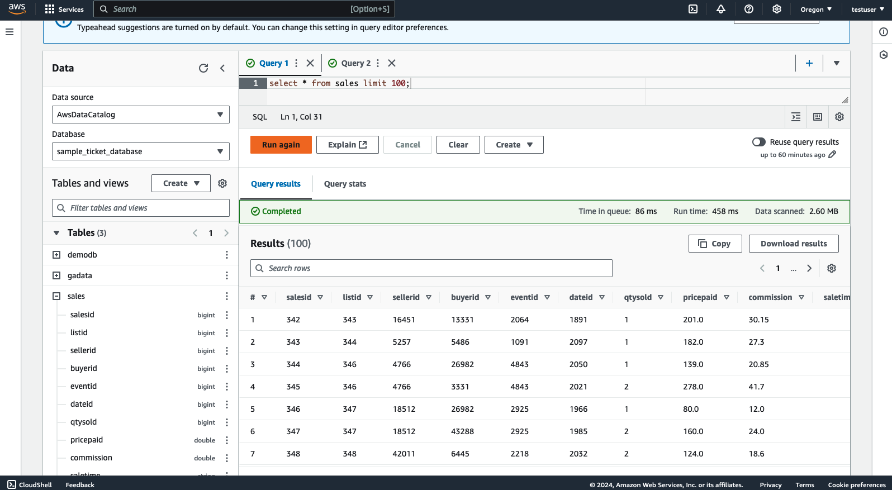
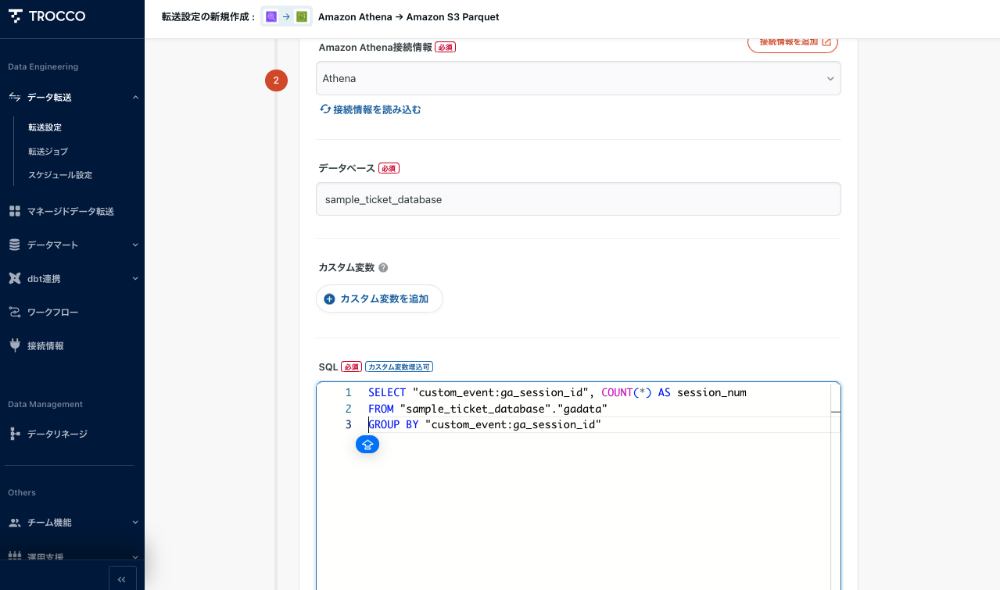
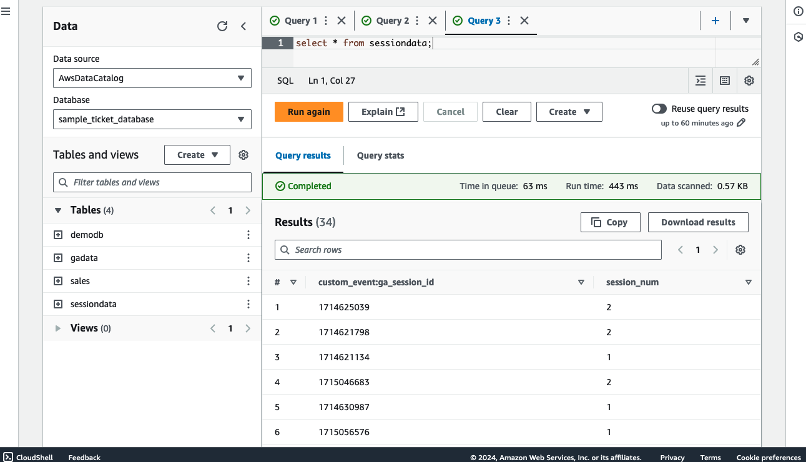
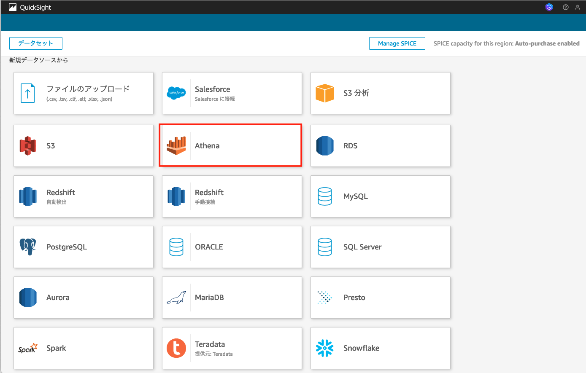

# Getting started

## Creating AWS Resources
1. (In case of setting up an Amazon Aurora Cluster as a sample) Create an S3 bucket and upload the .txt files extracted from startup-data-pipeline-samples/sampledata/sample.tar.gz to the S3 bucket.
2. Open the TROCCO console, click on the connection information, and select "Create destination information > Amazon S3".
   1. Make a note of the list of IP addresses displayed at the top of the screen.
   2. In the destination information section, select the IAM role and make a note of the TROCCO account ID and external ID.
3. Update the parameters in the config/config.ts file under the Stack's Props.


|Parameter	|Description|is Required?|
|---|---|---|
|troccoIPs |	List of TROCCO's source IP addresses|	Required|
|troccoAWSAccountId|	AWS account ID of the TROCCO environment	|Required|
|troccoExternalId|	External ID of the TROCCO environment|	Required|
|sampleDataBucket|	Bucket name to store the sample data	|Required|
|troccoTargetBucket|	Bucket name for TROCCO's data transfer	|Required|
|isExistDB|	Whether an existing Amazon Aurora Cluster exists|	Required|

4. Run the cdk command:

```
cdk deploy --all
```

5. (In case of setting up an Amazon Aurora Cluster as a sample) Import the sample data.
   1. Access the RDS from the EC2. Open the EC2 service page in the Management Console, select the instance starting with "AuroraTroccoSampleStack", and click "Connect".
   2. In this sample, you can access it through Session Manager. Select the Session Manager tab and connect.
   3. The database password is stored in the Secret Manager. Access the Secret Manager service page in the Management Console, and click on the Secret name output as AuroraTroccoSampleStack.RdsCredentialPath.
   4. Click `Retrieve secret value` to display the password.
   5. Use the output parameters from the deployment and enter the following command:

   ```
   mysql -h <AuroraTroccoSampleStack.TroccoDBClusterHostname> -u admin -p
   ```
   Enter the password when prompted.

   6. In the `sample/setupdata.sql` file, change the S3 bucket name in the `--- EDIT S3 BUCKET --- `section. The default is sample-ticket-data.
   7. Enter the SQL statements in the `sample/setupdata.sql` file to create the database, tables, and insert the data.

## Configuring TROCCO

### Configuring Google Analytics 4
Follow the steps in this guide: https://documents.trocco.io/docs/data-source-google-analytics4

1. In the Data Transfer > Create New Transfer Setting, select Google Analytics 4 as the source and Amazon S3 Parquet as the destination.

2. Configure the connection information for Google Analytics 4.
3. For the destination settings, configure the Amazon S3 connection information. Enter your AWS account ID and the IAM role name output as `TroccoS3AccessRoleName` from the cdk deployment.

4. After the settings are complete, click "Next Step". The Google Analytics data will be loaded.

5. In the detailed settings, select the output options and set "Data Catalog Configuration" to "Yes". This will automatically create the table in the Glue Catalog, allowing you to query it in Amazon Athena.
   1. Enter the database name in the AWS Glue database.
   2. Enter a table name.
   3. Set the action for existing tables to "Delete" to fully update the table on each transfer.

6. After completing the settings, click "Confirm and Apply".
7. Run the transfer job and verify that the table is created and can be queried in Amazon Athena.


### Configuring Amazon Aurora
Follow the steps in this guide: https://documents.trocco.io/docs/data-source-mysql

1. In the Data Transfer > Create New Transfer Setting, select MySQL as the source and Amazon S3 Parquet as the destination.
2. Configure the connection information for the MySQL data source.

The subsequent steps are the same as the Google Analytics 4 steps.




### Configure the processing process 

TROCCO allows you to define SQL-based processing operations using the Export function of Athena and set them up as a pipeline.

1. Open the New Transfer Setting under Data Transfer, and specify Amazon Athena as the source and Amazon S3 Parquet as the destination.

2. Follow the steps in [this document](https://documents.trocco.io/docs/data-source-athena) to set up the connection to Amazon Athena.
3. Define the data processing operation as an SQL query. In this example, we are displaying the number of sessions by session ID from the Google Analytics data.

4. The destination settings are the same as the previous step. Once completed, you can check if the data is accessible through Amazon Athena.


## Visualize in Amazon QuickSight

If you haven't created Amazon QuickSight Account yet, please refer the following document.
https://docs.aws.amazon.com/ja_jp/quicksight/latest/user/signing-up.html

1. Log in to Amazon QuickSight as an administrator.
2. Go to "Manage QuickSight" > "Security and Access" > "QuickSight's AWS Service Access", and click "Manage" for S3.

3. Select the S3 bucket and grant access permissions.

4. Create a new data source and select Athena.

5. Select the Glue database (same as the PIPELINE name) and the target table.

6. The data set is created, and you can now create dashboards and analyze the data.

