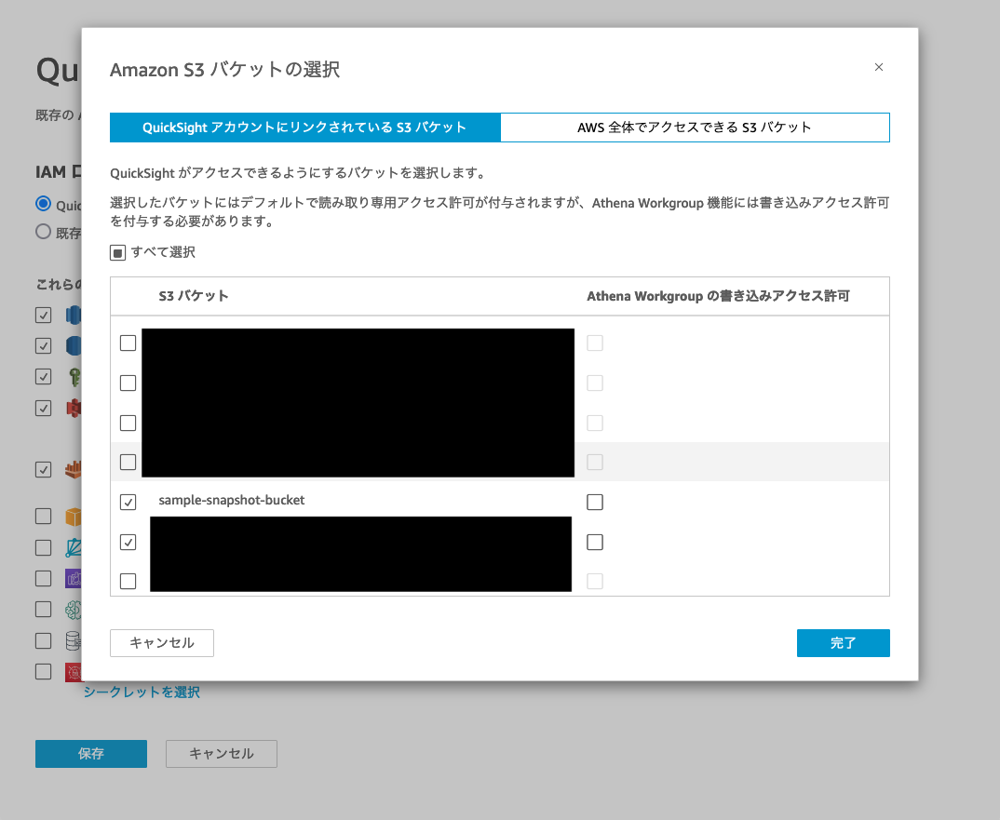
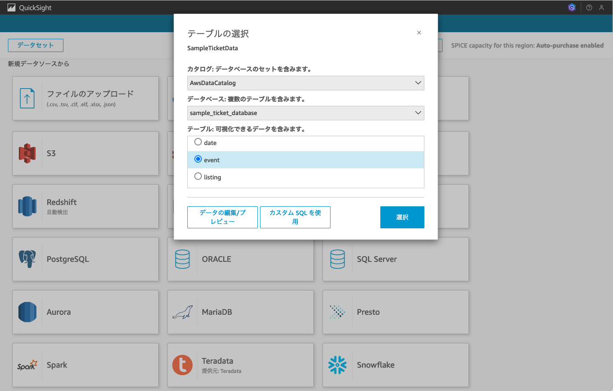
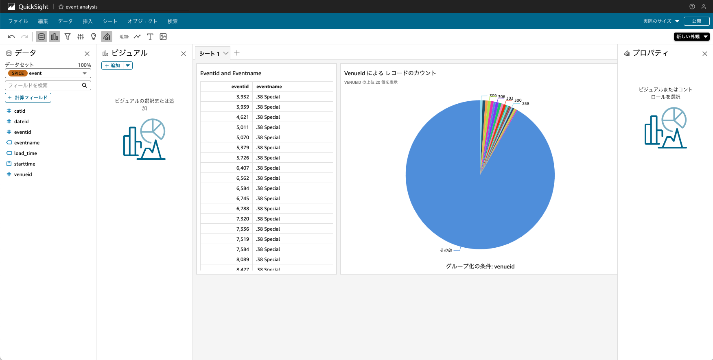

# Getting started

## AWS側のリソースの作成

1. （サンプル用のAmazon Aurora Clusterを立てる場合）S3に任意のバケットを作成し、`startup-data-pipeline-samples/sampledata/sample.tar.gz`　を解凍した .txt　ファイルをS3にアップロードします。
2. TROCCOの画面を開き、接続情報をクリックし、接続先情報の作成＞Amazon S3を選択します
   1. 画面上部に記載されているIPアドレスの一覧を控えます
   
   2. 画面後半にある接続先情報にて、IAMロールを選択してTROCCOのアカウントIDおよび外部IDを控えます
   
3. `config/config.ts`のStackのProps上のパラメーターを更新する。

|Paramter|内容|必須|
|---|---|---|
|troccoIPs|TROCCO側のアクセス元IPアドレスのリスト|必須|
|troccoAWSAccountId|TROCCO側環境のAWSアカウントID|必須|
|troccoExternalId|TROCCO側環境の外部ID|必須|
|sampleDataBucket|サンプルデータを格納するためのバケット名|必須|
|troccoTargetBucket|TROCCOの転送先となるバケット名|必須|
|isExistDB|既存のAmazon Aurora Clusterの有無|必須|

4. cdkのコマンドを実行する

```
cdk deploy --all
```

5. （サンプル用のAmazon Aurora Clusterを立てる場合）サンプルデータを取り込みます。
   1. EC2からRDSへのアクセスを行います。Management Console上でEC2のサービスページを開き、`AuroraTroccoSampleStack`から始まるインスタンス名を選択し、”Connect”をクリックします
   2. 本サンプルではSessionManagerからアクセスできるようになっています。SessionManagerタブを選択して、Connectします
   3. データベースのパスワードはSecretManagerに保存されています。Management Console上でSecretManagerのサービスページにアクセスし、デプロイ時の出力されたパラメーターのうち `AuroraTroccoSampleStack.RdsCredentialPath` で出力されているSecret名をクリックします
   4. Secret Valueのにて、 `Retrieve secret value`　をクリックすると、パスワードが表示されます。こちらを控えます。
   5. デプロイ時に出力されたパラメーターを利用して、以下のコマンドを入力します 

    ```
    mysql -h <AuroraTroccoSampleStack.TroccoDBClusterHostname> -u admin -p
    ```
    パスワード入力が求められるので、パスワードを入力します。

   6. `sample/setupdata.sql` の `--- EDIT S3 BUCKET ---` 以降で、手順1にて作成したS3バケットのバケット名を変更します。デフォルトは `sample-ticket-data`となっています。
   7. `sample/setupdata.sql` のSQL文を入力すると、データベース、テーブル、およびデータの挿入が実行されます

## TROCCO上で転送設定を行う
ここからはTROCCOのGUI上で設定を行っていきます。

### Google Analytics 4の設定を行う
こちらの手順に従って設定を行います。
https://documents.trocco.io/docs/data-source-google-analytics4

1. データ転送 > 転送設定の新規作成を開き、転送元にGoogle Analytics4, 転送先に Amazon S3 Parquet を指定します。

2. Google Analytics 4の接続情報を含む転送元情報を設定します
3. 転送先の設定にて、Amazon S3の接続情報を設定します。AWSアカウントIDは自身のアカウントIDを入力し、IAMロールは前段でcdk deployした際に出力されたパラメーターのうち `TroccoS3AccessRoleName` の値を入力してください。

4. 設定が完了したら、 「次のSTEPへ」をクリックします。すると、Google Analyticsのデータがロードされます

5. 詳細設定画面にて、出力オプションを選択し、「データカタログの設定」を「する」に選択します。こうすることで、自動的にGlueカタログにTableとして新規作成され、Amazon Athenaですぐにクエリできるようになります。
   1. データベースはAWS Glue上のデータベースを記入してください
   2. テーブルは、任意のテーブル名を入力してください
   3. テーブルがすでに存在した場合の動作は、Deleteにすることで更新ごとに全更新することができます

6. 完了したら、「確認画面へ」に進み、「保存して適用」をクリックしてください。これてTROCCOの設定は完了です。 
7. 実際にAthenaでクエリできるか確認しましょう。手順6に進むと、転送設定の画面に移るので、実行を押下しジョブを実行します。
8. 完了したら、AWSのマネジメントコンソール上でAmazon Athenaを開きます。該当のテーブルが作成され、クエリできることを確認しましょう。


### Amazon Auroraの設定を行う
こちらの手順に従って設定を行います。
https://documents.trocco.io/docs/data-source-mysql

1. データ転送 > 新規転送設定作成を開き、転送元にMySQL, 転送先にAmazon S3 Parquetを指定します
2. MySQLの接続情報を設定します。
3. 以降は Google Analytics 4 の手順2以降と同じです。転送ジョブを動作させたら、Amazon Athena上でクエリできることを確認してみましょう。


### 加工プロセスの設定を行う

TROCCOでは、AthenaのExport機能を利用してSQLベースの加工処理を定義し、パイプラインとして設定することができます。

1. データ転送 >  新規転送設定作成を開き、転送元にAmazon Athena, 転送先にAmazon S3 Parquestを指定します

2. [こちら](https://documents.trocco.io/docs/data-source-athena)の手順に沿って、Amazon Athenaの接続設定を行います  
    ※AWSの接続情報は、必ず専用のIAMユーザーを用意し手順にあるポリシーの付与に限定してください。（Admin権限のポリシーの付与はお控えください）
3. データ加工を行いたい処理をSQL文として定義します。この例では、Google Analyticsのセッション数をセッションIDごとに表示する加工を行っています。


4. 転送先の設定は前述と同じ手順です。完了したら、Amazon Athenaでクエリできるか確認してみましょう。


これでAmazon Athenaで加工済の分析ができるようになりました。このケースではGoogle Analyticsのテーブルデータのみを加工していますが、Amazon Auroraから出力したデータをJOINして加工することも可能です。


## Amazon QuickSight にて可視化する

Amazon QuickSightのアカウント作成をされていない方はこちらをご参照ください。

https://docs.aws.amazon.com/ja_jp/quicksight/latest/user/signing-up.html

1. Amazon QuickSightに管理者としてログインする
2. 右上の「QuickSightを管理」＞「セキュリティとアクセスの許可」> 「QuickSight の AWS のサービスへのアクセス」から、「管理」をクリックする

3. S3を選択肢し、対象のS3Bucketのアクセス権限を付与する

4. トップに戻り、データソースの作成をデータソースにAthenaを設定する

5. 対象のワークグループ、作成されたGlueデータベース（PIPELINE名と同一です）、対象のテーブルを選択します


6. データセットが作成され、データの中身が作成できたり、分析上でダッシュボードを作成できるようになります。

