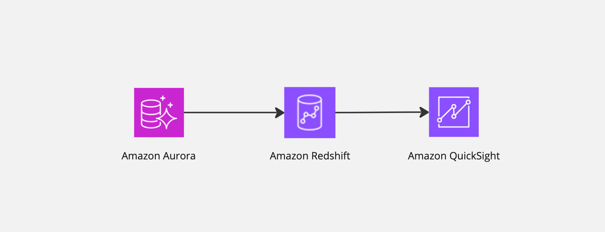

# Sync the data by Zero-ETL Integration

※ English follows Japanese.

このサンプルでは、AuroraとRedshiftのIntegration機能を利用したZero ETLのデータ同期を構築します。

## Architecture 

## コスト算出例
以下のユースケースの例の場合の算出例です。  
（こちらはあくまで一例ですので、正確な費用算出は自身の環境でテストして測定ください）

おおよその月額費用： 642.034 USD

* 一時間に一回AuroraのデータをRedshiftに同期する（更新時間は1分）
* 一日10人が10回程度クエリを投げる（平均3分かかるものとする）
* データ量は総計100GB

データクエリ：0.494 × 8(RPU) × (3min/60min) × 10（人） × 10 (回) × 30 (日)= 592.8USD  
データ同期：0.494 × 8(RPU) × (1min/60min) × 24（時間）× 30 (日)= 47.424USD  
データストレージ：100(GB) × 0.0261/GB = 2.61USD  

[📣**CAUTION**📣]  
Redshift ServerlessでZeroETLを有効化すると、最小である8RPUが常時有効化され、約3USD/hourの費用が発生します。  `REFRESH_INTERVAL` を指定して、同期の更新頻度を**必ず更新してください。**

**※ 補足**
* コンピューティング料金：USD 0.494 (1 RPU/時間あたり)
* ストレージ料金：月あたりUSD 0.0261/GB

## Getting started

[こちら](./doc/ja.md)  をご参照ください。

## Licence 
This library is licensed under the Apache 2.0 License. See the [LICENSE](./LICENSE) file.

 
 

# Sync the data by Zero-ETL Integration

This sample describes how to build the dataw warehouse with Redshift and Zero-ETL integration.

## Architecture 

## Expected Cost

This is an example of calculation in this use-case.
(Please measure with doing tests because this is example.)

Monthly cost: 642.032 USD

* Sync the data of Aurora to Redshift per an hour. 
* Query 10 times per a day.
* The amount of data is 10GB

**supplement**　 
* The computing cost : USD 0.494 (1 RPU/hour)
* The storege cost :  USD 0.0261/GB (monthly)

[📣**CAUTION**📣]   
If Zero-ETL integration has been enabled, the 8 RPU (minimum RPU) will be occupied, and the billing will be approximately $3 USD/hour. PLEASE UPDATE Zero-ETL Interval with `REFRESH_INTERVAL` describing bellow.

## Getting started

Please refer [here](./doc/en.md)

## Licence 
This library is licensed under the Apache 2.0 License. See the [LICENSE](./LICENSE) file.