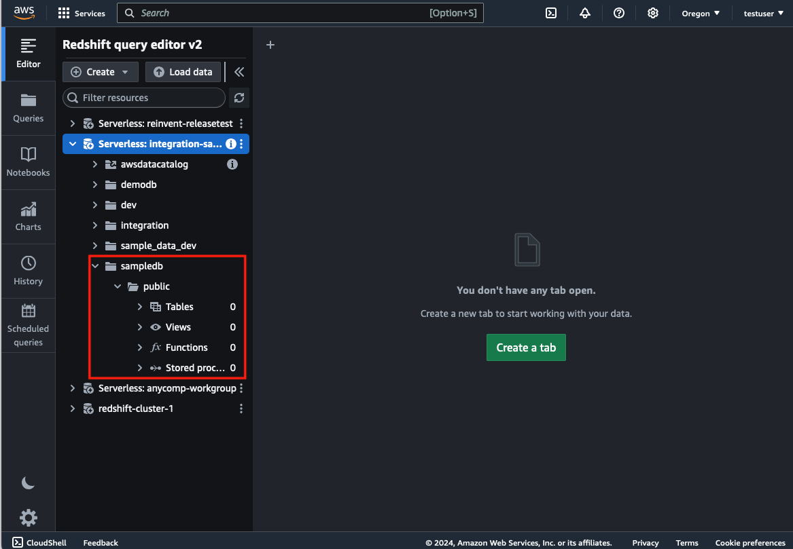

# Zero ETLによる同期
このサンプルでは、AuroraとRedshiftのIntegration機能を利用したZero ETLのデータ同期を構築します。

[📣**CAUTION**📣] 
Redshift ServerlessでZeroETLを有効化すると、最小である8RPUが常時有効化され、約3USD/hourの費用が発生します。 後述の `REFRESH_INTERVAL` を指定して、同期の更新頻度を**必ず更新してください。**

## 構成図 


## 想定コスト
以下のユースケースの例の場合の算出例です。  
（こちらはあくまで一例ですので、正確な費用算出は自身の環境でテストして測定ください）

おおよその月額費用： 642.034 USD

* 一時間に一回AuroraのデータをRedshiftに同期する（更新時間は1分）
* 一日10人が10回程度クエリを投げる（平均3分かかるものとする）
* データ量は総計100GB

データクエリ：0.494 × 8(RPU) × (3min/60min) × 10（人） × 10 (回) × 30 (日)= 592.8USD  
データ同期：0.494 × 8(RPU) × (1min/60min) × 24（時間）× 30 (日)= 47.424USD  
データストレージ：100(GB) × 0.0261/GB = 2.61USD  


**※ 補足**
* コンピューティング料金：USD 0.494 (1 RPU 時間あたり)
* ストレージ料金：月あたりUSD 0.0261/GB


## 構築手順

1. (サンプルデータを利用する場合) S3に任意のバケットを作成し、`sql/sampledata.tar.gz`　を回答した `.txt`　ファイルをS3にアップロードします。
2. （Option）Redshiftを手動でConsole上で構築する場合は、このタイミングで作成します。
   1. VPC、Private Subnet、SecurityGroupなど基本的なネットワークリソースを作成する  
        ※ 本サンプルで既存のVPCで構築する場合、**PrivateSubnetが必須になりますので事前に作成してください。**  
        ※ Redshift Serverlessの仕様上、AZは3つ作成する必要があります
   2. Redshift Serverlessの構築手順にのっとり構築する
3.  `config/config.ts` にて、パラメーターを入力します。

|Paramter|内容|
|---|---|
|dbClusterId|すでに構築しているRDSのClusterID|
|dbClusterEndpointName|すでに構築しているRDSのエンドポイント名|
|dbPort|すでに構築しているRDSのPort番号|
|redshiftNameSpaceId|すでに構築しているRedshiftのNamespace|
|redshiftWorkgroup|すでに構築しているRedshiftのWorkgroup|
|vpcId|構築したい対象のVPCID すでにRDSもしくはRedshiftを構築している場合そのVPCIDを記載する|
|S3Bucket|1で作成したバケット名|

パラメーター設定例：

* Auroraはすでに構築しているが、Redshiftは構築していない場合

```
{
    dbClusterId: "zeroetlrdsstack-rdsdatasource", 
    dbClusterEndpointName: "zeroetlrdsstack-rdsdatasourced9be52f4-xxxxxxxxxx.cluster-xxxxxxx.us-west-2.rds.amazonaws.com" ,
    dbPort: 3306, 
    vpcId:'vpc-0d19985635b7f80a8',
}
```

* Redshiftは構築しているが、Auroraは構築していない場合
```
{
    redshiftNameSpaceId:"059f43a7-2efb-41ef-b20b-b232f7a712e6", 
    redshiftWorkgroup:"zeroetl-integration-sample", 
    vpcId:'vpc-0d19985635b7f80a8',
    s3Bucket:'sample-ticket-data-bucket' 
}
```

* AuroraおよびRedshift双方構築していない場合
```
{
    s3Bucket:'sample-ticket-data-bucket' 
}
```

[📣**CAUTION**📣]  
Redshift Serverlessは、CDKを利用すると非常に時間がかかるので、Management Consoleで作成後こちらのパラメーターにセットいただくことをおすすめします。
https://docs.aws.amazon.com/ja_jp/redshift/latest/mgmt/serverless-console.html

4. 以下のコマンドを実行し環境を構築します。実行が完了したら、Outputsを控えます。

```
cdk deploy --all
```  

もし以下のエラーが発生する場合は、 `RedshiftStack`を明示的にデプロイしたあとに全体のデプロイを試してください。
```
Resource handler returned message: "You don't have access to zero-ETL integrations because the Amazon Re
dshift data warehouse doesn't exist or you don't have the required permissions. Check the resource polic
y of the data warehouse and make sure your user or role is specified as an authorized principal. 
```
コマンド例：

```
cdk deploy RedshiftStack
cdk deploy --all
```


Outputs例：
```
ZeroETLRDSStack.DBClusterHostname = zeroetlrdsstack-rdsdatasourced9be52f4-1n6k59bpeyg5.cluster-c3vdey2lveec.us-west-2.rds.amazonaws.com
ZeroETLRDSStack.ExportsOutputRefRDSDataSourceD9BE52F444306340 = zeroetlrdsstack-rdsdatasourced9be52f4-1n6k59bpeyg5
ZeroETLRDSStack.RdsCredentialPath = RDSDataSorce/admin
```

5. RedshiftのZero-ETL Integration上にDatabaseを定義します。
   1. AWSのManagement Consoleにアクセスし、Redshiftのサービスページを開きます
   2. Redshiftの左メニューから、Zero-ETL Integraion > Zero-ETL Integraionsから該当のIngestionを選択します
   3. ”Database creation required”と表示されるので、"Create database from ingestion" をクリックします
    
   4. Ingestion先のデータベース名を入力し "Create database"をクリックします
    
   5. DatabaseがActiveになっていることを確認します。
    

6. Redshift の Zero-ETL Integrationの更新頻度を設定します。
   1. AWSのManagement Consoleにアクセスし、Redshiftのサービスページを開きます
   2. RedshiftのQuery Editorを開き、SQLのEditorあるいはNotebookを開きます
   3. 以下のSQLコマンドを入力します（以下の例は、DATABASE_NAMEに対して 3600秒 = 1時間を指定しています）
   ```
   ALTER DATABASE {DATABASE_NAME} INTEGRATION SET REFRESH_INTERVAL 3600;
   ```
   4. `SVV_INTEGRATION`にて、更新頻度が更新されたか確認します
   ```
   select integration_id, target_database, refresh_interval from SVV_INTEGRATION;
   ```
   

これで設定は完了です

## データの同期を試す（Auroraをこのサンプルを用いて構築した場合）

※すでに自身で構築したAuroraを利用している場合は、ご自身で作成したデータがRedshiftに同期されているか確認してください。

1. Redshiftのサービスページに行き、QueryEditorを開きます。該当のNamespaceに相当するデータベースを開きます。実行前は何もデータベースが生成されていません


2. EC2からRDSへのアクセスを行います。Management Console上でEC2のサービスページを開き、”ZeroETLRDSStack”から始まるインスタンス名を選択し、”Connect”をクリックします
3. 本サンプルではSessionManagerからアクセスできるようになっています。SessionManagerタブを選択して、Connectします
4. データベースのパスワードはSecretManagerに保存されています。Management Console上でSecretManagerのサービスページにアクセスし、デプロイ時の出力されたパラメーターのうち `ZeroETLRDSStack.RdsCredentialPath` で出力されているSecret名をクリックします
5. Secret Valueのにて、 `Retrieve secret value`　をクリックすると、パスワードが表示されます。こちらを控えます。
6. デプロイ時に出力されたパラメーターを利用して、以下のコマンドを入力します 

```
mysql -h <ZeroETLRDSStack.DBClusterHostname> -u admin -p
```
パスワード入力が求められるので、パスワードを入力します。


7. `sql/setupdata.sql` の `--- EDIT S3 BUCKET ---` 以降で、手順1にて作成したS3バケットのバケット名を変更します。デフォルトは `sample-ticket-data`となっています。
8. `sql/setupdata.sql` のSQL文を入力すると、データベース、テーブル、およびデータの挿入が実行されます


9. Redshift上で同期されたデータを確認します。Management Console上でRedshiftのサービスページにアクセスし、Query Editorを開きます

10. RDSにデータを入れるとデータベースおよびテーブルが生成され、データが挿入されていることが確認できます。


## Amazon QuickSight に接続する
WIP（後日更新予定）


## Licence 
This library is licensed under the Apache 2.0 License. See the [LICENSE](./LICENSE) file.
