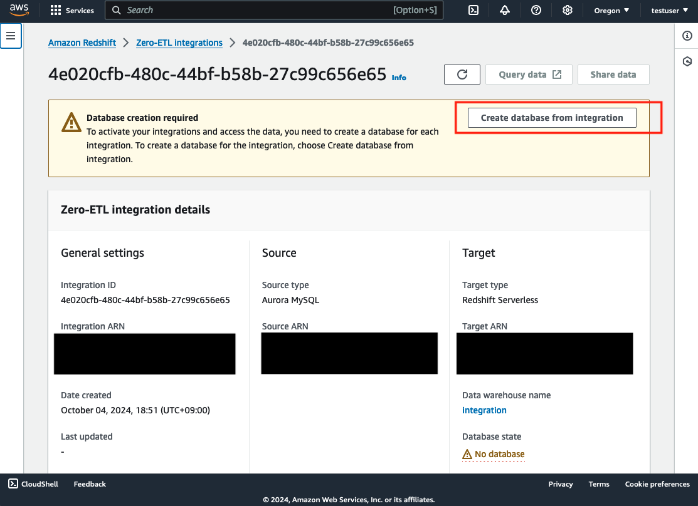
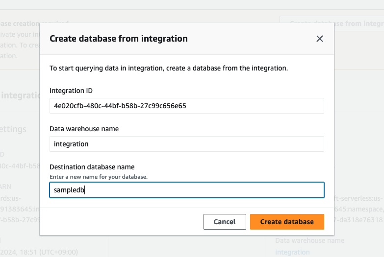
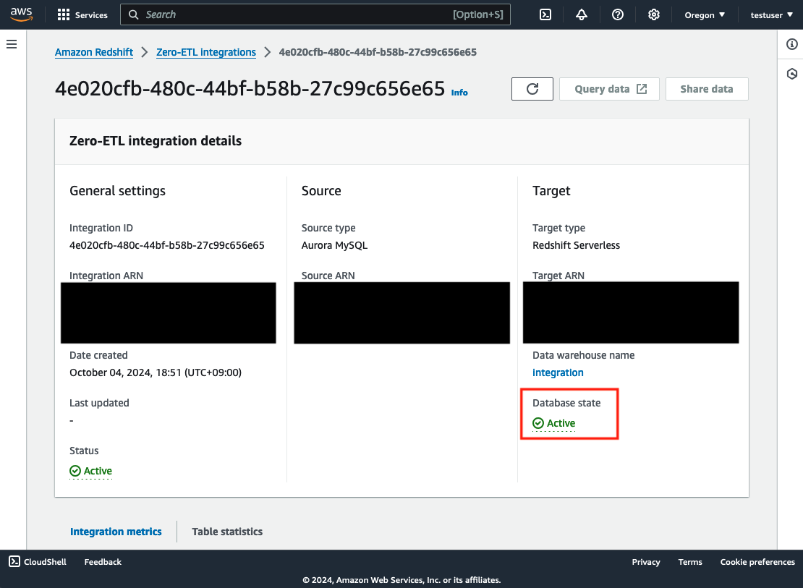
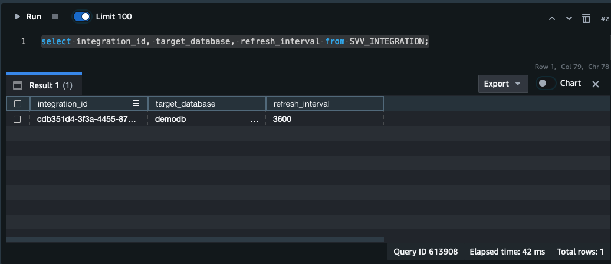
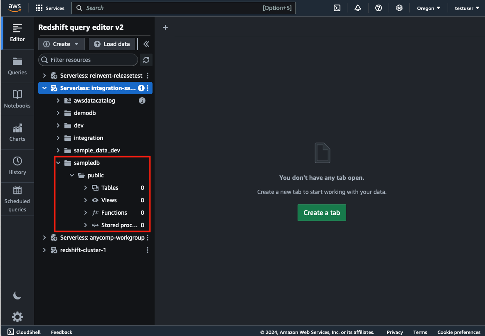
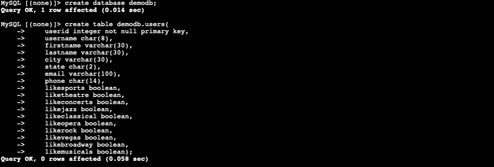
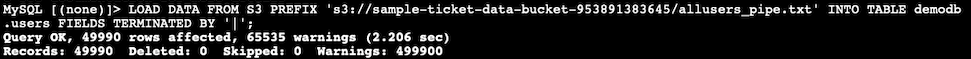
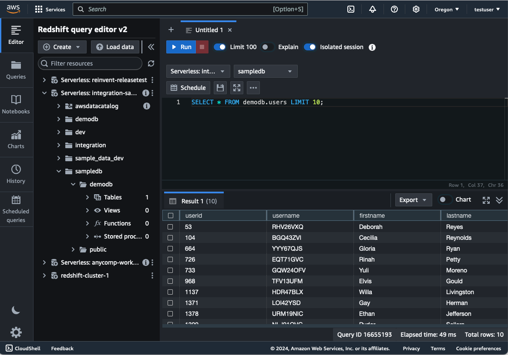

## Getting started

[📣**CAUTION**📣]   
If Zero-ETL integration has been enabled, the 8 RPU (minimum RPU) will be occupied, and the billing will be approximately $3 USD/hour. PLEASE UPDATE Zero-ETL Interval with `REFRESH_INTERVAL` describing bellow.

1. (If you use the sample data) Create the bucket and upload  `.txt` files from `sql/sampledata` unzipped.
2. (Option) If you create a Redshift resource with Management console, create at this step.
   1. Create network resources (VPC, Private Subnet, SecurityGroup)
        NOTE: A private subnet is required in this sample (in the case that you create RDS Cluster with this CDK)
        NOTE: The subnet across 3AZ are required by Redshift Serverless
   2. Create Redshift Serverless resource (refer to [the doc](https://docs.aws.amazon.com/ja_jp/redshift/latest/gsg/new-user-serverless.html#serverless-console-resource-creation))
3. Define the parameters in `config/config.ts`

|Paramter|Details|
|---|---|
|dbClusterId|The cluster ID of RDS already created.|
|dbClusterEndpointName|The endpoint of RDS already created.|
|dbPort|The port of RDS already created.|
|redshiftNameSpaceId|The namespace ID of Redshift already created.|
|redshiftWorkgroup|The workgroup of Redshift already created.|
|vpcId|The ID of target VPC. If the resource of RDS or Redshift is created, define the vpc where they exist.|
|S3Bucket|The bucket name created ad Step 1|

The example of defining parameters:

* Aurora was created, but Redshift was not created.

```
{
    dbClusterId: "zeroetlrdsstack-rdsdatasource", 
    dbClusterEndpointName: "zeroetlrdsstack-rdsdatasourced9be52f4-xxxxxxxxxx.cluster-xxxxxxx.us-west-2.rds.amazonaws.com" ,
    dbPort: 3306, 
    vpcId:'vpc-0d19985635b7f80a8',
}
```

* Redshift was created, but Aurora was not created.
```
{
    redshiftNameSpaceId:"059f43a7-2efb-41ef-b20b-b232f7a712e6", 
    redshiftWorkgroup:"zeroetl-integration-sample", 
    vpcId:'vpc-0d19985635b7f80a8',
    s3Bucket:'sample-ticket-data-bucket' 
}
```

* Both Aurora and Redshift were not created.
```
{
    s3Bucket:'sample-ticket-data-bucket' 
}
```

[📣**CAUTION**📣]  
It takes **a long time** to deploy the Redshift Serverless resource If you try it with this CDK. It is RECOMMENDED to deploy with Management Console and set the parameters of what created.
https://docs.aws.amazon.com/en_us/redshift/latest/mgmt/serverless-console.html

1. Deploy this asset. After this process ends, take **the Outputs parameters**.

```
cdk deploy --all
```  

The example of OUTPUTS：
```
ZeroETLRDSStack.DBClusterHostname = zeroetlrdsstack-rdsdatasourced9be52f4-1n6k59bpeyg5.cluster-c3vdey2lveec.us-west-2.rds.amazonaws.com
ZeroETLRDSStack.ExportsOutputRefRDSDataSourceD9BE52F444306340 = zeroetlrdsstack-rdsdatasourced9be52f4-1n6k59bpeyg5
ZeroETLRDSStack.RdsCredentialPath = RDSDataSorce/admin
```

5. Define the Database on Zero-ETL Integration
   1. After accessing the management console, open the Redshift Service Page.
   2. Select the Integration created by this CDK in the Zero-ETL Integration page from the left menu.
   3. Click "Create database from Integration" from the "Database creation required" section at the top of the page.
   
   4. Define the database name and click "Create database".
   
   5. Check that the status of the database section is "Active".
   

6. [**ACTION REQUIRED**] Set the interval of the Zero-ETL integration.
   1. After accessing the management console, open the Redshift Service Page.
   2. Open the Query Editor from the Redshift page, create a new notebook or new editor.
   3. Enter the following SQL. (This example defines 3600 seconds = an hour)
   ```
   ALTER DATABASE {DATABASE_NAME} INTEGRATION SET REFRESH_INTERVAL 3600;
   ```
   4. Review the updated interval.
   ```
   select integration_id, target_database, refresh_interval from SVV_INTEGRATION;
   ```
   


## Try the data sync (the case of deploying sample database by cdk)

※ If you use the aurora cluster already created, try with own data.

1. Open the Redshift Service page, and open the Query Editor. Check the Database of the namespace created. There is no database before inserting data to RDS.


2. Access RDS from EC2. Open EC2 Service page on Management Console, select instance name starting with "ZeroETLRDSStack", and click "Connect".
3.  In this sample, you can access by SessionManager. Select SessionManager tab and click "Connect". You will be able to access EC2 console.
4.  The password of database is save in Secret Manager. Access the page of Secret Manager Service and click the secret desplayed as the name exported from the Outputs as `ZeroETLRDSStack.RdsCredentialPath`.
5.  Click `Retrieve secret value`, the password will be desplayed. Take this password.
6.  In EC2 console, execute the following command.
```
mysql -h <ZeroETLRDSStack.DBClusterHostname> -u admin -p
```
7. Mofify the bucket name that is defined under of  `--- EDIT S3 BUCKET ---` on `sql/setupdata.sql`. The defalut value is `sample-ticket-data`.
8. Execute the SQL in the `sql/setupdata.sql` file. The database, table, and data insertion will be started.


9. Review the data synced on Redshift. Open the Redshift console and click "Open Query Editor"
10. You will be able to check that the database, table is created and the data is inserted.
 
 

 ## Connect Amazon QuickSight
 Work In Progress...
